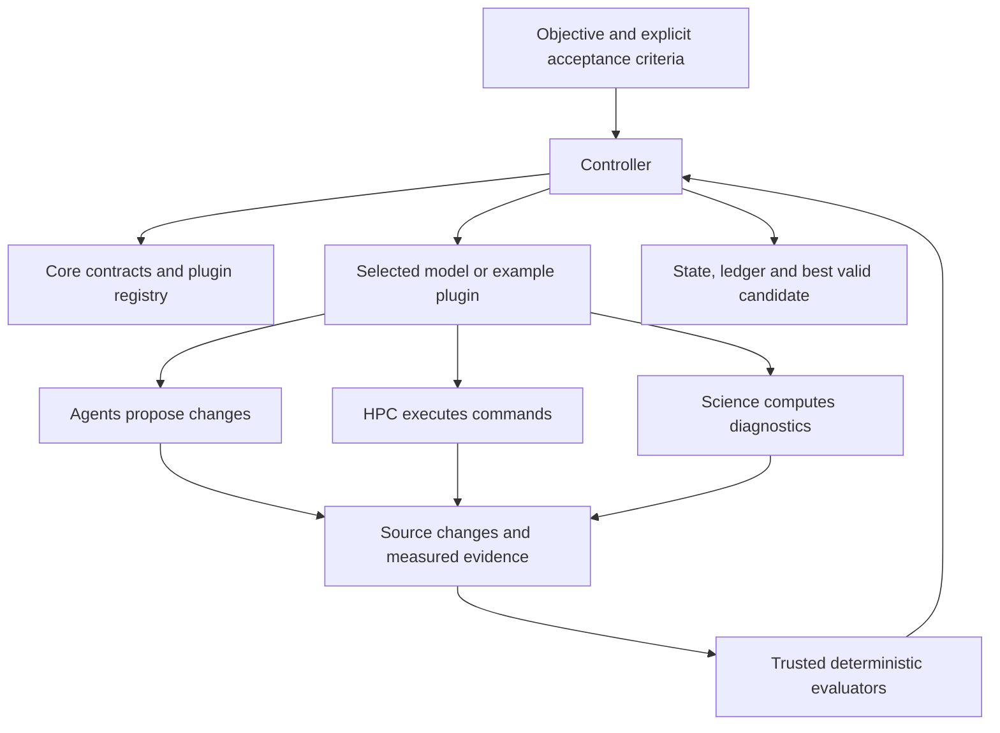

# Repository map

**Start here:** `nexus-atom-controller` is the main documentation and command-line entry point. It is not a monorepo; each sibling is an independently built Python distribution. Install matching release versions together.

| Repository | Python package | Responsibility | Dependencies within ATOM |
|---|---|---|---|
| [Core](https://github.com/NexusATOM/nexus-atom-core) | `nexus_atom_core` | Protocol: goals, task DAGs, budgets, resources, plugins, artifacts, evaluations, experiments and provenance | None |
| [Controller](https://github.com/NexusATOM/nexus-atom-controller) | `nexus_atom_controller` | Planning/execution loop, deterministic acceptance, checkpointing, ledger, CLI and local inspection service | Core; demo extra uses HPC and Science |
| [Agents](https://github.com/NexusATOM/nexus-atom-agents) | `nexus_atom_agents` | NOOA, OpenAI and local proposal runtimes; explicit routing and context | Core |
| [HPC](https://github.com/NexusATOM/nexus-atom-hpc) | `nexus_atom_hpc` | Local and Slurm job execution, resources, modules, containers, logs and accounting | Core |
| [Science](https://github.com/NexusATOM/nexus-atom-science) | `nexus_atom_science` | Reusable diagnostics, numerical comparison, weighted conservation, statistics, datasets and plots | Core |
| [GEOS](https://github.com/NexusATOM/nexus-atom-geos) | `nexus_atom_geos`, retained `geos_agents` | GEOS federation/worktrees, configured build/run/profile/optimization workflows, evaluators and legacy tools | Core, Agents, HPC, Science |

## Using the GEOS specialists

The [GEOS repository](https://github.com/NexusATOM/nexus-atom-geos) is the canonical
home of the NOOA specialists, agent CLI, durable sessions, and ATOM GEOS plugin.
Its [agent usage guide](https://github.com/NexusATOM/nexus-atom-geos/blob/main/docs/AGENTS.md)
explains all six roles, tool integration, and runnable examples. The agent CLI
can run without Controller; the shared ATOM libraries remain package dependencies.
ATOM's Agents package supplies interchangeable proposal backends rather than a
second copy of the specialist roles. Install GEOS with `[nooa]` for specialist
reasoning. Do not co-install the old `nexus-geos-agent` distribution, which uses
the same import/CLI names. Agent sessions and Controller experiments have separate
persistent-state formats.

## How they connect

The controller does not know how to compile GEOS or how NOOA calls a model. Plugins supply those details. A capability may be a deterministic function, a workflow, a process or an agent-backed proposal. Evaluators, not agent text, decide whether the goal is met.

## Where to change things

| You want to… | Work in… |
|---|---|
| Add a reusable protocol field or new artifact contract | Core; then test all dependent repositories |
| Change planning, stopping, policy, state or task scheduling | Controller |
| Add a model provider or coding-agent process | Agents |
| Add a scheduler or site execution feature | HPC |
| Add a model-independent metric or data reader | Science |
| Change GEOS repository understanding, commands, targets or physical interpretation | GEOS |
| Add a new model integration | A plugin using Core contracts; start with the bundled examples |

## Example and production status

`atom demo` lives under `nexus_atom_controller.examples.toy` and needs no Earth-system model. ECCO/LIS/ISSM/ModelE toy entry points live in `nexus_atom_geos.examples` for now; they demonstrate the plugin boundary. `examples/multimodel.py` runs two such plugins under one goal. This is orchestration, not physical coupling.

The original GEOS Agent implementation, tests, examples, documentation and Git history are migrated into GEOS with Apache-2.0 attribution. Its [migration record](https://github.com/NexusATOM/nexus-atom-geos/blob/main/docs/MIGRATION.md) identifies preserved releases and file coverage; the old repository is no longer required.

Dedicated ECCO/LIS/ISSM/ModelE repositories, data/observations/assimilation packages and UI are deferred, as requested by the plan. Actual Discover GEOS validation remains a separate acceptance milestone. See [implementation status](IMPLEMENTATION.md).

## Release and CI

Every repository builds a wheel and sdist and has CI for Python 3.12 and 3.13. Development CI clones sibling main branches to verify cross-package compatibility. Release tags use a matching version across the six repos; use those tags for reproducible installation. The bootstrap tool preserves existing working checkouts and never resets your changes.
